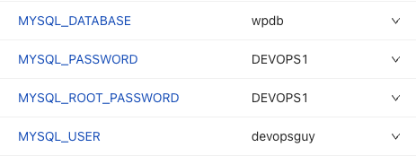

```
      containers:
      - image: wordpress:latest
        name: wordpress
        env:
          - name: WORDPRESS_DB_HOST
            value: {{appname}}
          - name: WORDPRESS_DB_USER
            value: {{MYSQL_USER}}
          - name: WORDPRESS_DB_PASSWORD
            value: {{MYSQL_PASSWORD}}
          - name: WORDPRESS_DB_NAME
            value: {{MYSQL_DATABASE}}
          - name: WORDPRESS_DEBUG
            value: “1”
```

Notice how the Parameter names are in a Jinja2-like syntax. The values inside of the curly brackets are the names of the Parameters in CloudTruth. Below is a screenshot of the Parameters in CloudTruth.


