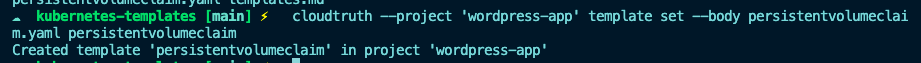
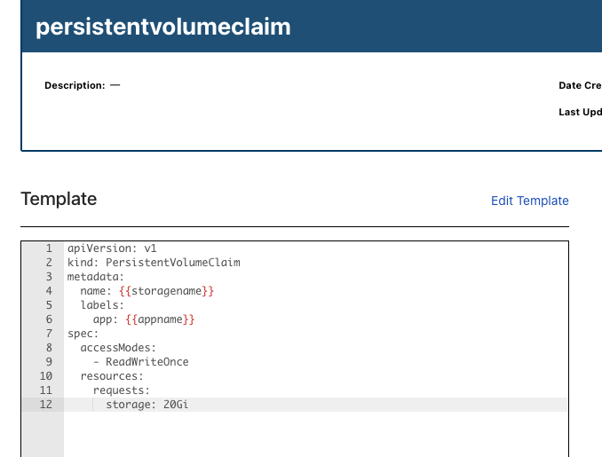

In this lab, you'll learn how you no longer have to worry about having multiple Kubernetes Manifests that essentially do the same thing, but are tweaked a little bit differently for each environment (like Dev, Staging, Prod, etc.).

First, you'll need a Kubernetes Manifest. You can take the Kubernetes Manifests from the `app-with-cloudtruth` directory, but for simplicity purposes, let's take the snippet below which is creating the `PersistentVolumeClaim`.

```
apiVersion: v1
kind: PersistentVolumeClaim
metadata:
  name: {{storagename}}
  labels:
    app: {{appname}}
spec:
  accessModes:
    - ReadWriteOnce
  resources:
    requests:
      storage: 20Gi
```

Notice how it's ready to ingest CloudTruth parameters by using the `{{}} blocks along with the parameter name, which were creating in the [Create Parameters For Wordpress Deployment](https://github.com/cloudtruth/Config-The-Hard-Way/blob/main/cloudtruth_commands/parameters/params.md) lab

Running the below command will take the `persistentvolumeclaim.yaml` and turn it into a template within CloudTruth.

`cloudtruth --project 'wordpress-app' template set --body persistenvolumeclaim.yaml persistentvolumeclaim`

The output will be similar to the screenshot below showing that the template was created in the `wordpress-app` project



When you log into CloudTruth, you'll see the `persistentvolume` template created


If you click on the template, you'll see that the template exists



Now you can add parameters specifically for that template