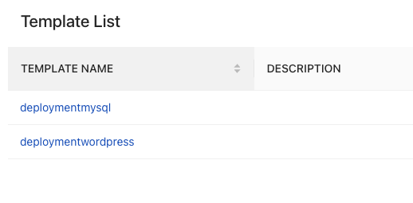

## Prerequisites
To follow along with this documentation, ensure that you have:
- Finished the creation of your CloudTruth project from Lab 3 [Creating A New Project](https://github.com/cloudtruth/Config-The-Hard-Way/blob/main/cloudtruth_commands/project/readme.md)
- Access to create an API key for CloudTruth
- Either an AKS, EKS, or GKE cluster from Lab 2.

## The Setup

1. Add in the Kubernetes parameters you want CloudTruth to manage. This can be anything from secrets to Docker image names to port numbers. You can find what parameters to add in from fifth lab, [Creating CloudTruth Parameters For The Application](https://github.com/cloudtruth/Config-The-Hard-Way/blob/main/cloudtruth_commands/parameters/params.md)

2. Open the `app-with-cloudtruth` directory on your terminal
3. Run the following commands to let CloudTruth know which exact Kubernetes manifests to use and to store the template inside of CloudTruth. The `--project` is `wordpress` because that's the project that we created in Lab 3.
```
cloudtruth --project 'wordpress' template set --body wordpress-deployment.yaml deploymentwordpress
cloudtruth --project 'wordpress' template set --body mysql-deployment.yaml deploymentmysql
```



The `deployment` at the end of the command in step 7 indicates that we're running a Kubernetes `deployment`. If it was, for example, a Kubernetes `service`, the command would say `service` at the end instead of `deployment`.

Or just use the Nginx deployment found under the `nginx-sample` directory

7. Configure the operator configuration. Create a new file called `ctdeploytest-values.yaml` and add the following into it.
```
# Applying deployment resources requires additional permissions
rbac:
  additionalRoleRules:
    - apiGroups: ["", "extensions", "apps"]
      resources: ["deployments", "replicasets", "pods", "services"]
      verbs: ["*"]

# Kubetruth is configured using a CustomResourceDefinition called
# ProjectMapping, which allows one to specify how the operator
# transforms the data from your CloudTruth projects into kuberenetes
# resources
projectMappings:

  # Define the root project mapping, skipping all projects except for the
  # example we care about
  root:
    scope: "root"
    environment: default
    skip: true

  # Define an override ProjectMapping to enable deployment of CloudTruth projects named k8s*
  k8s-deploy:
    scope: "override"
    skip: false
    project_selector: "^k8s-"
    resource_templates:
      deployment: '{{ templates.deployment }}'
      service: '{{ templates.service }}'
```

Ensure that the `ctdeploytest-values.yaml` file is saved in the same location that your file containing the Kubernetes deployment is located.

8. Install and run KubeTruth, the Kubernetes operator (A Kubernetes operator is a method of packaging, deploying, and managing a Kubernetes application)

```
helm repo add cloudtruth https://packages.cloudtruth.com/charts/
helm install --values ctdeploytest-values.yaml --set appSettings.apiKey=$CLOUDTRUTH_API_KEY kubetruth cloudtruth/kubetruth
```

Another option is to run the Helm Chart in a specific namespace. That way, it's easier to clean up later on. If you don't, `Kubetruth` will pick up all of the Kubernetes `deployments`/`services`/etc. in the `default` namespace

```
helm repo add cloudtruth https://packages.cloudtruth.com/charts/
helm install --create-namespace --namespace ctdeploytest --values ctdeploytest-values.yaml --set appSettings.apiKey=$CLOUDTRUTH_API_KEY kubetruth cloudtruth/kubetruth
```